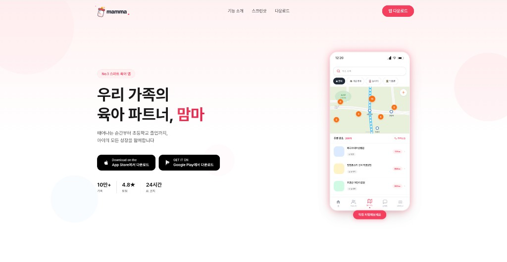

# 맘마 (Mamma) — mamma.im

## 🌐 서비스 바로가기

# **[https://mamma.im](https://mamma.im)**

<p align="center">
  
</p>

우리 가족의 육아 파트너, **맘마**의 랜딩 페이지입니다.

태어나는 순간부터 초등학교 졸업까지, 아이의 모든 성장을 함께하는 스마트 육아 앱을 소개합니다.

안드로이드, 애플 스토어 심사진행중입니다. 4월 초 정식에 서비스 예정입니다.

## 주요 화면 미리보기

### 1) 오늘의 기록과 육아 루틴

<p align="center">
  
  
</p>

### 2) 육아 커뮤니티와 소통

<p align="center">
  
</p>

### 3) AI 성장/패턴 분석

<p align="center">
  
  
</p>

### 4) 빠른 기록과 생활 편의

<p align="center">
  
  
</p>

## 기술 스택

| 영역 | 기술 |
|------|------|
| 프레임워크 | [Next.js](https://nextjs.org/) 16 (App Router) |
| UI | [React](https://react.dev/) 19, [TypeScript](https://www.typescriptlang.org/) 5 |
| 스타일링 | [Tailwind CSS](https://tailwindcss.com/) 4 |
| 애니메이션 | [Framer Motion](https://www.framer.com/motion/) 12 |
| 아이콘 | [Lucide React](https://lucide.dev/) |
| 폰트 | [Pretendard](https://cactus.tistory.com/306) (CDN) |

## 프로젝트 구조

```
src/
├── app/
│   ├── layout.tsx        # 루트 레이아웃 (메타데이터, 폰트)
│   ├── page.tsx          # 홈 페이지 (섹션 조합)
│   └── globals.css       # Tailwind 테마 및 글로벌 스타일
├── components/
│   ├── Header.tsx        # 네비게이션 헤더 (모바일 메뉴 포함)
│   ├── HeroSection.tsx   # 히어로 섹션 + 폰 목업
│   ├── FeaturesSection.tsx  # 기능 소개 카드
│   ├── ScreenshotGallery.tsx # 앱 스크린샷 갤러리
│   ├── DownloadCTA.tsx   # 다운로드 CTA 배너
│   └── Footer.tsx        # 푸터 (링크, 연락처)
└── lib/
    └── utils.ts          # 유틸리티 (cn 함수)
```

## 시작하기

### 사전 요구 사항

- Node.js 18 이상
- npm, yarn, pnpm, 또는 bun

### 설치 및 실행

```bash
# 의존성 설치
npm install

# 개발 서버 실행
npm run dev
```

[http://localhost:3000](http://localhost:3000)에서 확인할 수 있습니다.

### 빌드

```bash
# 프로덕션 빌드
npm run build

# 프로덕션 서버 실행
npm run start
```

### 린트

```bash
npm run lint
```

## 환경 설정

현재 환경 변수 파일(`.env`)은 별도로 필요하지 않습니다.  
메타데이터의 기본 URL은 `https://mamma.im`으로 설정되어 있습니다.

## 배포

Next.js 앱으로, [Vercel](https://vercel.com)을 통한 배포를 권장합니다.

## 라이선스

Private
